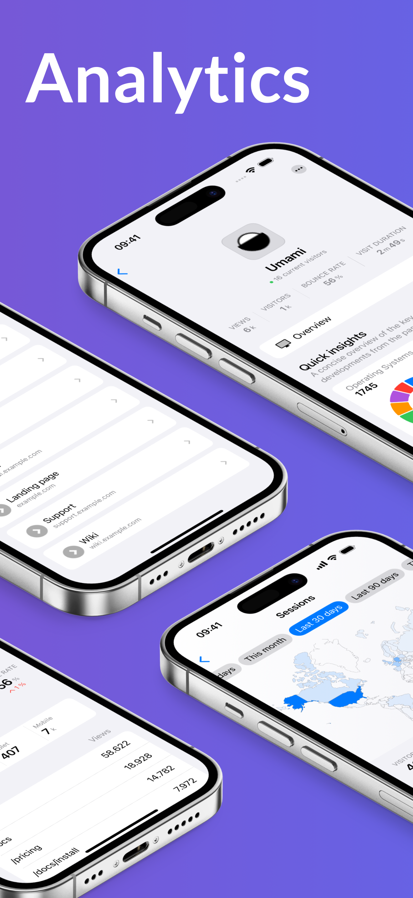
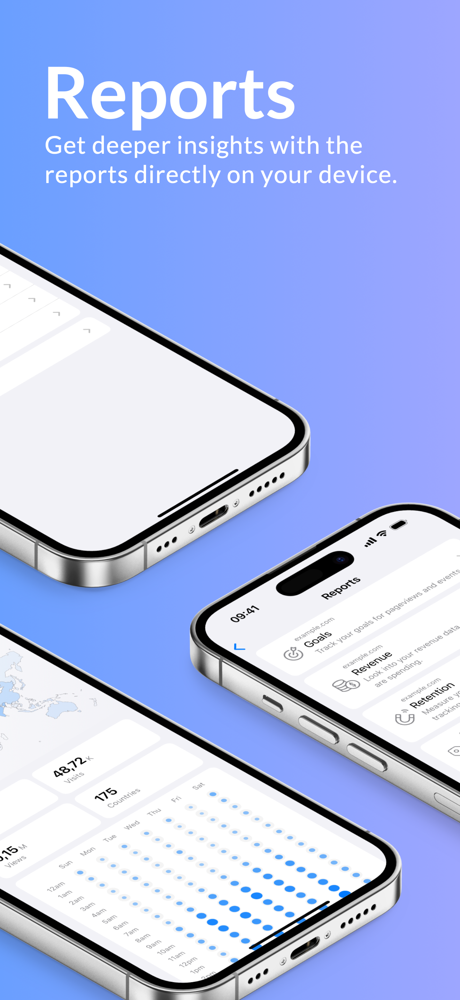
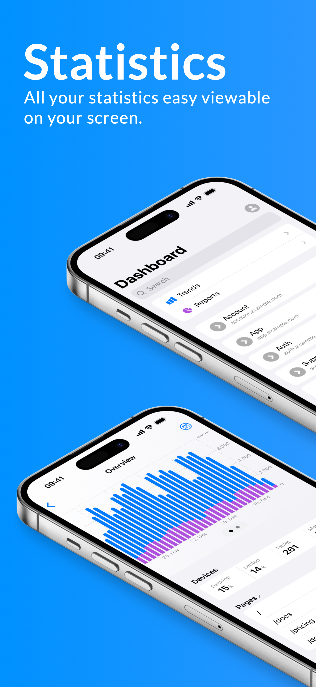

    

# umami Analytics
Your iOS Client for [umami Analytics](https://umami.is) (Self-Hosted & Cloud)
    

Experience umami Analytics on your iOS device.\
Easily access all your key metrics, whether you use a self-hosted or cloud-based umami instance.

<table>
  <tr>
    <td></td>
    <td></td>
    <td></td>
    <td></td>
  </tr>
</table>

### 🌟 Key Features
- Comprehensive Metrics: Stay on top of all essential analytics.\
- Event Tracking: Monitor and analyze specific events.\
- Session Overview: Gain detailed insights into user behavior.\
- Real-Time Visitors: See who is currently browsing your site.\
- Time Range Comparisons: Compare current data with previous periods for deeper analysis.\
- Report Generation: Create and share detailed reports with ease.

### 🔧 Additional Features
- Website Management: Add new websites or modify existing ones.\
- Team Management: Manage team members and their access permissions.\
- User Administration: Create and manage user accounts directly from the app.

### 🛠 Requirements
- umami Analytics: A running instance of umami Analytics self-hosted or an cloud account.\
    - Cloud: An API key\
    - Self hosted: Hostname, username and password

### 🚀 Quick Start
1.	Download the app: Install it from the App Store or via TestFlight.
2.	Log in: Enter your umami instance URL and credentials or the API key from cloud.
3.	Start analyzing: Access your analytics data directly on your iOS device.

### 📝 Feedback & Support
We’d love to hear your feedback!
For questions or suggestions, visit the Discord channel or create an issue in this repository.

      
 \
[TestFlight Beta](https://testflight.apple.com/join/AYfPX1Ut) 

